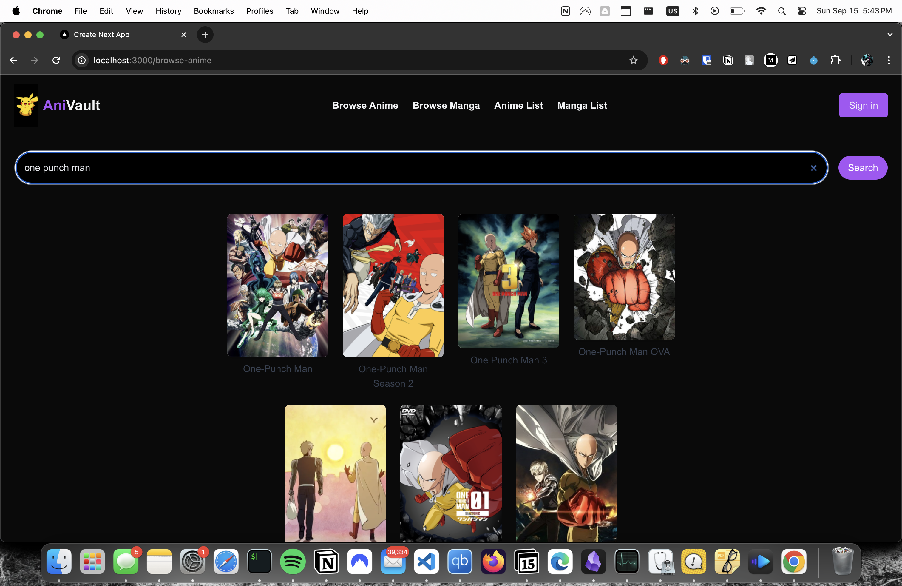

# AniVault - Anime and Manga Tracker

AniVault is a web application for tracking your favorite anime and manga. Built with Next.js, it leverages the AniList GraphQL API to fetch data, uses Supabase for a PostgreSQL database, and integrates Clerk for seamless authentication. The app is styled with Tailwind CSS for a modern and responsive design.

## Features

- **Track Anime and Manga:** Search, add, and manage your favorite anime and manga.
- **Detailed Information:** Fetch data like ratings, descriptions, and more from the AniList API.
- **User Authentication:** Secure user accounts with Clerk.
- **Custom Lists:** Create and organize custom lists of anime and manga.
- **Responsive Design:** Optimized for all devices using Tailwind CSS.
- **Real-time Updates:** Leverages Supabase to provide a responsive and real-time experience.

## Tech Stack

- **Framework:** [Next.js](https://nextjs.org/) - A React framework for server-side rendering and static site generation.
- **Styling:** [Tailwind CSS](https://tailwindcss.com/) - A utility-first CSS framework for rapid UI development.
- **Database:** [Supabase](https://supabase.com/) - A hosted PostgreSQL database with real-time capabilities.
- **Authentication:** [Clerk](https://clerk.dev/) - A plug-and-play user management system.
- **API:** [AniList GraphQL API](https://anilist.co/) - A comprehensive API for anime and manga data.

## Getting Started

To get started with AniVault, follow these steps:

1. **Clone the repository:**

   ```bash
   git clone git@github.com:arish73/AniVault.git
   cd AniVault
   ```

2. **Install dependencies:**

   ```bash
   npm install
   # or
   yarn install
   ```

3. **Create environment variables:**

   - Create a `.env.local` file in the root directory.
   - Add your environment variables for Supabase, Clerk, and AniList API keys:

   ```bash
   NEXT_PUBLIC_SUPABASE_URL=your_supabase_url
   NEXT_PUBLIC_SUPABASE_ANON_KEY=your_supabase_anon_key
   CLERK_FRONTEND_API=your_clerk_frontend_api
   ANILIST_API_KEY=your_anilist_api_key
   ```

4. **Run the development server:**

   ```bash
   npm run dev
   # or
   yarn dev
   ```

   Open [http://localhost:3000](http://localhost:3000) with your browser to see the app.

## Deployment

You can deploy this Next.js app using [Vercel](https://vercel.com/), the creators of Next.js. For more details on deploying, refer to the [Next.js deployment documentation](https://nextjs.org/docs/deployment).

## Contributing

Contributions are welcome! Feel free to open issues or submit pull requests.

## License

This project is licensed under the MIT License.

## Contact

If you have any questions or suggestions, feel free to reach out at [your-email@example.com](mailto:your-email@example.com).


